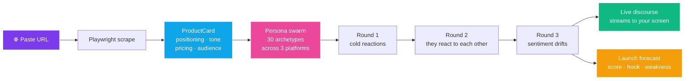
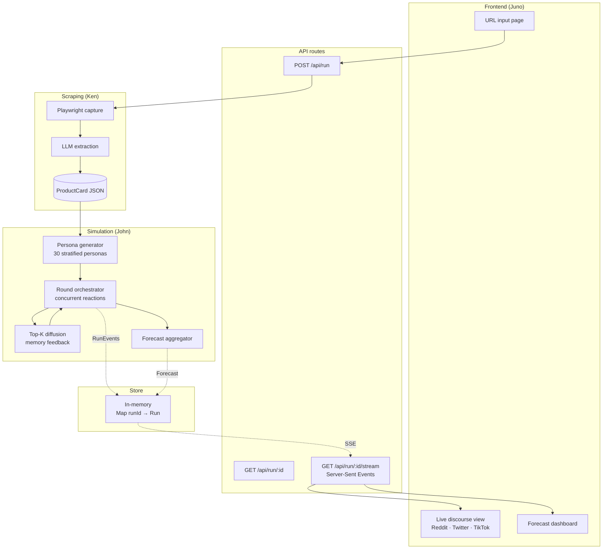

<div align="center">


# Signal

### *We simulated the internet reacting to your launch — before you shipped it.*

[](https://nextjs.org/)
[](https://www.typescriptlang.org/)
[](https://tailwindcss.com/)
[](https://playwright.dev/)
[](https://openrouter.ai/)

**Paste a URL. Run the room. Ship with conviction.**

[Live demo](#try-the-pre-warmed-demos) · [How it works](#how-it-works) · [Quick start](#quick-start)

</div>

---

<div align="center">

> ## *"What if your launch could fail in a sandbox first?"*

</div>

<p align="center">
  
</p>

---

## The pain we're killing

You vibe-coded a thing. It works. The landing page is up. Now what?

<table>
<tr>
<td width="50%" valign="top">

### Without Signal

```
Day 0:  Ship to Product Hunt
Day 0:  12 upvotes (all from group chat)
Day 1:  r/SideProject top reply: "what does this even do?"
Day 1:  Tweet dies in 40 impressions
Day 7:  Rewrite headline. Again.
Day 14: Realize your pricing page is the problem.
Day 21: Run out of runway to rebuild positioning.
```

You launched blind. The internet decided in 90 seconds.
You spent 3 weeks figuring out what it decided.

</td>
<td width="50%" valign="top">

### With Signal

```
Minute 0: Paste URL
Minute 1: 30 personas spawn — Reddit, Twitter, TikTok
Minute 2: Top Reddit comment forms — you see exactly
          what they're confused about
Minute 3: Twitter ratio appears — and the one quote-tweet
          that becomes the breakout take
Minute 4: Forecast lands → Score 64. Hook: "the demo."
          Weakness: "headline reads generic."
Minute 5: Rewrite headline. Re-run. Score climbs to 81.
Minute 6: Ship.
```

You ship with the receipts already in hand.

</td>
</tr>
</table>

---

## What it does, in one diagram



Each round, the loudest reactions feed back into every persona's "feed memory" — so by Round 3, the room has a vibe. **That's the moment the simulation goes from cute to predictive.**

---

## What you actually get

Four artifacts. All screenshot-ready.

### 1. Your fake Reddit thread

```
┌──────────────────────────────────────────────────────────┐
│ r/SideProject  ·  Posted by u/founder_anon  ·  6h        │
├──────────────────────────────────────────────────────────┤
│  ▲   Built a tool that simulates your launch before you  │
│ 247  even ship. Roast it.                                │
│  ▼                                                        │
├──────────────────────────────────────────────────────────┤
│   ▲ 184  u/skeptical_dev_2014  · 5h                       │
│         "Cool concept but how is this not just astrology  │
│         for indie hackers?"                               │
│         ↳ 32 replies                                      │
│                                                           │
│   ▲ 98   u/yc_alum_brag  · 4h                             │
│         "this is exactly what we wished we had before     │
│         our launch tanked. ngmi without it"               │
│                                                           │
│   ▲ 41   u/has_seen_competitor  · 3h                      │
│         "have you seen [insert tool you've never heard    │
│         of]? does the same thing."                        │
└──────────────────────────────────────────────────────────┘
```

### 2. Your Twitter discourse

```
┌──────────────────────────────────────────────────────────┐
│  @design_critic · 2h                                      │
│  the headline on this is generic but the demo            │
│  absolutely cooks. fix the top of the page and           │
│  this is a hit                                            │
│                          ♻ 412   ❤ 1.2k   💬 89           │
├──────────────────────────────────────────────────────────┤
│  @vc_thread_guy · 1h                                      │
│  10 reasons "simulate-your-launch" is the next           │
│  $1B category — a thread 🧵                              │
│                          ♻ 891   ❤ 3.1k                   │
├──────────────────────────────────────────────────────────┤
│  @hn_dunker · 47m                                         │
│  this is just a wrapper around an LLM                    │
│                          ♻ 12    ❤ 4    💬 203 (ratio)    │
└──────────────────────────────────────────────────────────┘
```

### 3. Your TikTok comments

```
TikTok · POV: you found this before you launched
─────────────────────────────────────────────────
♥ 4.2k   no bc this is actually genius
♥ 2.1k   downloading rn
♥ 1.8k   this fixed my landing page in 3 minutes
♥   847  the algorithm sent me here for a reason
♥   612  ok but who is this FOR though
♥   401  felt the second one in my soul
```

### 4. Your launch forecast

```
┌─────────────────────────────────────────────────────────┐
│  LAUNCH SCORE                              VIRALITY     │
│  ┌──────────┐                              ┌────────┐   │
│  │   72     │   "good but not viral"       │  64%   │   │
│  └──────────┘                              └────────┘   │
├─────────────────────────────────────────────────────────┤
│  SENTIMENT                                              │
│  Reddit   ████████░░░░░░░░  positive but skeptical      │
│  Twitter  ████████████░░░░  hyped                       │
│  TikTok   ██████████░░░░░░  vibes-positive              │
├─────────────────────────────────────────────────────────┤
│  BIGGEST VIRAL HOOK                                     │
│  → "the demo video does the talking"                    │
│                                                          │
│  BIGGEST WEAKNESS                                       │
│  → "headline is generic — every persona stalled here"   │
│                                                          │
│  PREDICTED HOT TWEETS                                   │
│  1. "fixed my positioning in 3 minutes"                 │
│  2. "ok but is this just astrology for founders"        │
│  3. "this is the missing tool in the indie stack"       │
└─────────────────────────────────────────────────────────┘
```

---

## Why this is different

| | Real launch | Customer interviews | A/B test | **Signal** |
|---|---|---|---|---|
| Time to feedback | 2–4 weeks | 2–3 weeks | 1–2 weeks | **60 seconds** |
| Cost | Your reputation | $$$  | Real traffic | One LLM call |
| Iteration speed | Once | Hard to repeat | Slow loops | **Unlimited reruns** |
| Voice diversity | Whoever shows up | 5–10 people | Aggregate only | **30 archetypes** |
| Failure cost | Public, permanent | High | Medium | **Zero** |
| Screenshot-shareable | Sometimes | Never | No | **Yes** |

---

## Built for

<table>
<tr>
<td width="33%" align="center" valign="top">

### Vibe coders & indie hackers

Find out what the top comment is going to be **before it's the top comment**.

</td>
<td width="33%" align="center" valign="top">

### Founders rewriting copy

A/B test positioning against a simulated audience instead of waiting two weeks for real traffic.

</td>
<td width="33%" align="center" valign="top">

### Solo creators

You can't afford a 5-person research panel. Signal **is** the panel.

</td>
</tr>
</table>

---

## Honest disclaimer

This is **narrative analysis disguised as forecasting.** The launch score is not a KPI prediction.

What it *is*: an emotionally believable, screenshot-worthy read on whether your positioning lands. If your meanest critic and your target customer respond the same way in the room, that's a real signal — and you can ship on it.

---

## Architecture



**Stack:** Next.js 16 (App Router) · TypeScript · Tailwind 4 · Playwright · OpenRouter · Zod · Server-Sent Events · in-memory run store. Single repo, no separate backend.

---

## How it works

The orchestrator runs multiple rounds. Each round:

1. Sample idle personas across the three platforms.
2. Run reactions concurrently (semaphore: ~10 in flight).
3. Take the top-K loudest reactions and feed them back into every persona's "feed memory."
4. Re-sample. Repeat.

This is the moment that makes the demo magical — the room sees a controversial take, and **the next round drifts in response**, the way real Twitter does when one quote-tweet lands wrong.

---

## Quick start

```bash
npm install
npm run playwright:install        # one-time: downloads Chromium
cp .env.example .env.local         # add your OPENROUTER_API_KEY
npm run dev
```

Open [http://localhost:3000](http://localhost:3000), paste a URL, watch the room.

### Try the pre-warmed demos

The landing page ships with three:

| Demo | What it shows |
|---|---|
| **DemoFlow** | Clean winner. The room gets hyped. |
| **Yet-another-newsletter** | Confusing positioning. Watch every persona ask the same question. |
| **Lonely-as-a-service** | Polarizing. Watch the ratio form in real time. |

---

## The team

Built at a hackathon by three people, three modules, one weekend.

| | Owner | Module | Lives in |
|---|---|---|---|
| **Scrape** | Ken | URL → ProductCard | `lib/scrape/`, `app/api/scrape/` |
| **Simulate** | John | ProductCard → discourse + forecast | `lib/agents/` |
| **Render** | Juno | live UI + dashboard | `app/`, `components/` |

Three modules. Clean JSON contracts in `lib/shared/types.ts`. Built in parallel. Shipped in a weekend.

---

<div align="center">

### Stop launching blind.

# Run the room first.

**[→ Try a demo](#try-the-pre-warmed-demos)** &nbsp;·&nbsp; **[→ Run it locally](#quick-start)**

</div>
