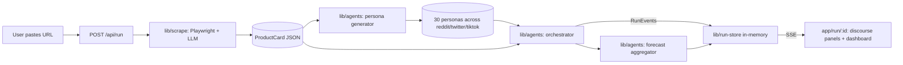

# Vibe App Launch Simulator

## Pitch

> *"We simulated the internet reacting to your launch."*

Paste a landing-page URL. We scrape it, generate ~30 internet personas tailored to its audience, run a multi-round discourse simulation where agents react to the page **and to each other**, and show you:

- a **fake Reddit thread** about your launch
- **simulated Twitter discourse** (replies, quote-tweets, ratios)
- **fake TikTok comments**
- a **launch forecast**: score, virality potential, most-likely audience, biggest viral hook, biggest weakness, sentiment breakdown by platform, top quotes, predicted hot tweets

This is **narrative analysis disguised as forecasting**. The point isn't statistical truth — it's a screenshot-worthy, emotionally believable read on whether your positioning lands.

## Why a landing page is enough

A landing page already contains: positioning, pricing, tone, target audience, visuals, social proof, value proposition, CTA strategy, product maturity, vibes. That's exactly what internet users react to. We don't need to drive a live `browser-use` session through the product itself — the page tells us everything reactions will be based on.

## Architecture



Per round, the orchestrator: samples idle personas, calls `generateReaction` per persona concurrently (semaphore), feeds the top-K most upvoted/controversial reactions back into every persona's "feed memory" so subsequent rounds drift sentiment based on social proof — this is how the demo gets the *"wait, the sentiment just turned"* moment.

## Stack

- **Next.js 16** (App Router) + **TypeScript** + **Tailwind 4** — single repo, no separate backend
- **Playwright** — Chromium, self-hosted; run `npm run playwright:install` once after clone
- **OpenRouter** — single LLM provider, free model by default (Gemini 2.0 Flash exp). Switch via `OPENROUTER_MODEL` env var.
- **Zod** — schema validation at module boundaries
- **Server-Sent Events** — `/api/run/:id/stream` pushes `RunEvent`s to the dashboard
- **In-memory run store** — `Map<runId, Run>`, no DB

## File layout

```
app/
  page.tsx                         URL input (stubbed)
  run/[id]/page.tsx                Live discourse + dashboard view (Juno)
  api/scrape/route.ts              POST /api/scrape — isolated scrape endpoint (Ken)
  api/run/route.ts                 POST /api/run — kicks off scrape + sim
  api/run/[id]/route.ts            GET — run snapshot
  api/run/[id]/stream/route.ts     GET — SSE event stream

lib/
  shared/types.ts                  Zod schemas + types: ProductCard, Persona, Reaction, Forecast, RunEvent
  scrape/                          Owner: Ken
    index.ts                         scrapeProductCard(url) entry
    playwright.ts                    capturePage helpers
    extract.ts                       LLM extraction step
    README.md
  agents/                          Owner: John
    index.ts                         runSimulation entry
    archetypes.ts                    predefined internet archetypes
    personas.ts                      persona generator
    reactions.ts                     per-persona reaction LLM call
    orchestrator.ts                  round loop + diffusion
    forecast.ts                      final aggregation
    README.md
  llm/openrouter.ts                Thin OpenRouter client (chat + chatJSON)
  run-store.ts                     In-memory Run map + emit/subscribe

components/                       Owner: Juno
  README.md                        (panels live here: RedditThread, TwitterDiscourse, TikTokComments, LaunchScoreGauge, ...)
```

## Team & ownership

The three modules talk **only** through the JSON contracts in `lib/shared/types.ts`. Ownership is strict — keep changes within your module so the three of you can work in parallel without merge conflicts.

### Ken — Scraping → ProductCard JSON

**Lives in:** `lib/scrape/*`, `app/api/scrape/route.ts`
**Reads from `lib/shared/types.ts`:** `ProductCard`, `ProductCardSchema`
**Outputs:** a validated `ProductCard` from any landing-page URL.

Tasks:
1. Implement `capturePage(url)` in `playwright.ts` — Chromium, `networkidle`, full-page screenshot (base64), trimmed text content, nav links, og:* metadata.
2. Implement `extractProductCard(capture)` in `extract.ts` — feed the text + screenshot to OpenRouter (`lib/llm/openrouter.ts`'s `chatJSON`) with a system prompt that asks for strict JSON matching `ProductCardSchema`. Validate before returning.
3. Test `POST /api/scrape` against 3 real URLs: a clean SaaS landing, a confusing/jargon-heavy one, a polarizing one. Confirm fields populate.
4. Edge case: if Playwright is blocked (CF challenge, etc.), return a partial ProductCard with `risk_factors: ["scraper_blocked"]` rather than throwing.

### John — Personas + simulation orchestration

**Lives in:** `lib/agents/*`
**Reads from `lib/shared/types.ts`:** `Persona`, `Reaction`, `Forecast`, `RunEvent`, `ProductCard`
**Outputs:** stream of `RunEvent`s via the `onEvent` callback, plus a final `Forecast`.

Tasks:
1. Flesh out `archetypes.ts` (5 starter archetypes are stubbed; add 5–10 more — niche dev Twitter, design Twitter, Hacker News dunker, productivity TikTok, indie founder Reddit, etc.).
2. Implement `generatePersonas(product, count=30)` — single batched LLM call, stratified across platforms and archetypes.
3. Implement `generateReaction(persona, product, memory, round)` — short comment in persona voice, sentiment, friction points. Memory is the top-K reactions from the previous round.
4. Implement `orchestrateRound(...)` — sample subset, run reactions concurrently with a semaphore (~10 in flight), emit each `Reaction` event through `onEvent` as it lands.
5. Implement `aggregateForecast(...)` — sentiment clustering, top quotes per platform, hot-tweet generation, narrative summary in one LLM call.
6. Wire it all together in `runSimulation` (already stubbed in `index.ts`).

### Juno — Dashboard & live UI

**Lives in:** `app/page.tsx`, `app/run/[id]/page.tsx`, `components/*`
**Reads from `lib/shared/types.ts`:** `RunEvent`, `Forecast`, `ProductCard`, `Persona`, `Reaction`
**Inputs:** `EventSource('/api/run/:id/stream')` events + `GET /api/run/:id` snapshot.

Tasks:
1. Polish the URL input page (`app/page.tsx`) — copy refinement, optional pre-warmed example buttons (good / confusing / polarizing demo URLs).
2. Build the **live discourse view** in `app/run/[id]/page.tsx` + `components/`:
   - `RedditThread.tsx` — fake subreddit, upvote counter ticking, threaded replies. Filter `events` where `platform === "reddit"`.
   - `TwitterDiscourse.tsx` — fake X timeline, retweets and quote-tweets visible. Filter `platform === "twitter"`.
   - `TikTokComments.tsx` — fake comment column, hearts, reply chains. Filter `platform === "tiktok"`.
   - Animate comments easing in as they stream — Framer Motion is fine. Stagger so the eye can follow.
3. Build the **forecast dashboard** that swaps in when the `forecast` event arrives:
   - `LaunchScoreGauge.tsx` (0–100), `ViralityMeter.tsx`
   - `SentimentBars.tsx` — per-platform breakdown
   - `TopComments.tsx` — verbatim, screenshot-worthy
   - `HotTweets.tsx` — predicted breakout tweets
   - `WeaknessCard.tsx`, `ViralHookCard.tsx`, `UXFrictionList.tsx`
4. **Make the panels look real enough to screenshot and share.** This is the viral surface — nail the platform aesthetic (Reddit's beige, X's dark, TikTok's right-rail).

## Local setup

```bash
npm install
npm run playwright:install        # once: downloads Chromium
cp .env.example .env.local         # add OPENROUTER_API_KEY
npm run dev
```

Open http://localhost:3000.

## MVP cut list (ship in this order)

1. **Vertical slice with stubs**: scrape a single hardcoded URL → fixed personas → fixed reactions → render. Proves the pipe end-to-end.
2. **Real scraping** (Ken) — first piece that adds magic; the ProductCard makes everything downstream feel custom.
3. **Real personas + reactions** (John) — second magic moment; comments start sounding distinct.
4. **Real-time SSE animation** (Juno) — the WOW; comments stream in live.
5. **Forecast dashboard** (Juno + John) — ties the bow.
6. **Stretch**: pre-warmed demos, "inject a variable" mid-sim (e.g., "HN dunker arrives"), screenshot/share button on the discourse panels.

## Risks / tradeoffs

- **Free model quality**: free OpenRouter models occasionally return ill-formed JSON. `chatJSON` strips code fences but stronger validation may need retries. If quality wobbles, switch `OPENROUTER_MODEL` to a paid Haiku/Flash tier.
- **Playwright on hosted infra**: Vercel doesn't run Chromium. For deploy, target Render/Fly/Railway, or use `@sparticuz/chromium` + Playwright-aws-lambda. For the demo, local is fine.
- **Persona uniformity**: if all comments sound the same, the demo dies. Stratify hard, vary `posting_style` per persona, seed each prompt with 2–3 in-style examples.
- **Believability vs. truth**: Be honest in the UI — call it *"forecast"* / *"simulated discourse"*, not *"prediction"*. The whole pitch is that this is narrative analysis.
- **Differentiation from MiroFish**: ours takes a real running web app (not text seeds), outputs a Product-Hunt/Twitter/TikTok forecast (not abstract analytics), aimed at vibe coders. Lean into the framing in the pitch.

## Demo storyline (90 seconds)

1. Paste a vibe-coded app URL (have 2–3 pre-warmed: a clear winner, a confusing one, a polarizing one).
2. The page transitions to the live view. Status ticks: "Scraping…" → ProductCard appears in the corner.
3. 30 persona avatars spawn into the three panels. Comments start streaming in — Reddit first (skeptical), then Twitter (hot takes), then TikTok (vibes).
4. A controversial reply hits the top of the Reddit panel. Watch follow-up comments shift tone in response.
5. After ~60s, dashboard slides in: "Launch score: 72. Virality: 64%. Biggest viral hook: time-saving demo. Biggest weakness: positioning reads generic. 4 critical UX issues."
6. Switch to the "confusing" pre-warmed app — show how the forecast inverts (low score, lots of "what does this even do?" comments).
