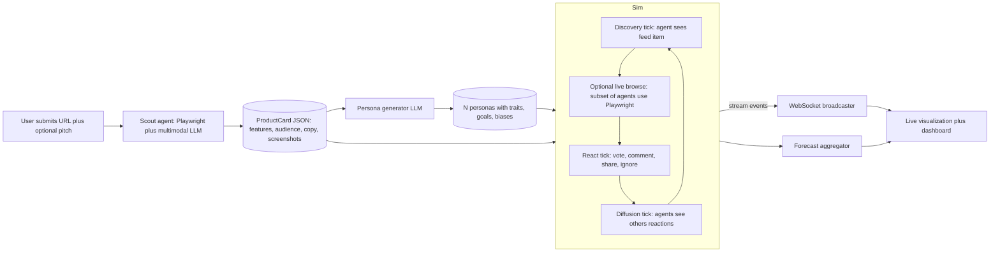

# Vibe-Coded App Launch Simulator

## What we're building (the elevator pitch)

A "MiroFish for vibe-coded apps". User pastes a URL of their newly-built app (Lovable, v0, Cursor, Bolt, etc.). A scout agent **actually browses the site**, extracts what it does and who it's for, then we spin up a **swarm of LLM personas** tailored to that product who:

1. Discover the app on a simulated Product Hunt / Twitter feed
2. Read its pitch + (optionally) click into the live site
3. Upvote / skip, post comments, share, or roast it
4. Influence each other through social signals (social proof, controversy)

The user watches it unfold **live** (animated swarm, comment feed ticking, upvote counter rising) and gets a **forecast dashboard** at the end: predicted PH rank, sentiment breakdown, top quotes, UX friction list, and viral hot-takes — all segmented by persona type.

This is differentiated vs. existing work:
- **MiroFish** ([mirofish.ink](https://mirofish.ink/)) takes text seeds; ours takes a **real running web app** and grounds reactions in what agents actually saw on the page.
- **LaunchSim, Stunt Double, CBrowser, Flock Synthetics** do persona browsing OR launch simulation; we **fuse both** into a single live-visualized launch day.
- **Stanford Generative Agents** (Park et al. 2023) gave us the memory + reflection + planning recipe we'll borrow at small scale.

## Architecture



## Components

### 1. Scout agent — `backend/scout.py`
- Use **Playwright** (or `browser-use` Python SDK) to load the URL.
- Extract: page title, hero copy, primary CTA, screenshots of viewport, list of nav links, top 1–2 internal pages, detected category (landing page, SaaS dashboard, game, tool, etc.).
- Feed screenshots + DOM text to a multimodal LLM (Claude Sonnet / GPT-4o-class) with a JSON schema prompt → produces a `ProductCard`:
  ```json
  { "name": "...", "tagline": "...", "category": "...",
    "key_features": ["..."], "target_audience": ["..."],
    "ux_flow": ["..."], "screenshots": ["..."], "vibes": ["..."] }
  ```
- Why a single multimodal call vs. full GraphRAG: hackathon scope; one structured extraction is "good enough" and sub-30s.

### 2. Persona generator — `backend/personas.py`
- Input: `ProductCard`. Output: `N` personas (default 50, configurable to a few hundred).
- One LLM call asks for a stratified sample tailored to the product's audience (e.g., dev tool → indie hackers, senior devs, PMs, skeptics, hype-bros). Each persona has:
  - `archetype`, `demographics`, `goals`, `pet_peeves`, `tech_savvy`, `patience`, `risk_tolerance`, `posting_style`, `following_count` (controls social weight).
- Cheap and fast: single batched generation, ~5–10s for 50 personas.

### 3. Simulation engine — `backend/sim.py`
- Tick-based loop, ~20 ticks per simulated "launch day". Each tick:
  1. **Discovery**: each idle persona has a probability of seeing the post in their feed (modulated by current upvote count → social proof).
  2. **Browse** (subset): for ~5–10% of personas (or persona types flagged "hands-on"), spawn a real `browser-use` session that visits the URL with a goal derived from the persona's needs. The session returns a short experience report (what worked, what confused them).
  3. **React**: LLM call per persona producing `{action: vote|skip|comment|share, comment_text, sentiment, friction_points[]}`. Prompt includes the persona, the ProductCard, optional browse report, and a window of recent comments (memory).
  4. **Diffuse**: top-K most upvoted/controversial comments enter every persona's "feed memory" for next tick.
- **Concurrency**: `asyncio.gather` with a semaphore (e.g., 20 concurrent LLM calls). Use a small/fast model (gpt-5.5-fast, Claude Haiku, Gemini Flash, or whatever the team has credits for) for reaction ticks; keep the multimodal model only for the scout step.
- **Stream events** over a WebSocket as they happen so the UI animates live.

### 4. Forecast aggregator — `backend/forecast.py`
- After the run, produce:
  - Predicted PH metrics: total upvotes, rank band (#1–5 / top 10 / etc.), comment count.
  - Sentiment distribution per persona segment.
  - Top 5 "verbatim" comments (highest engagement).
  - UX friction hot list (clustered from `friction_points` across browse reports).
  - "What Twitter would say": 3 hot-take tweets generated from controversy clusters.
- One final LLM call to summarize raw event log → narrative analysis.

### 5. Frontend — `frontend/`
- **Stack**: Next.js + Tailwind + Framer Motion + `react-force-graph` or `d3-force` for the swarm.
- **Three views**, switchable:
  - **Swarm view**: animated nodes (one per persona) clustering around the product, glowing when they upvote, popping a speech bubble when they comment, edges between personas who reply to each other.
  - **Feed view**: a fake Product Hunt page where comments stream in live, upvote counter ticks up, sorted by hot.
  - **Dashboard view**: post-run analytics — gauges, persona-segmented sentiment bars, top quotes, friction list, predicted hot tweets.
- WebSocket client (`/ws/sim/:runId`) drives all three.

## Tech stack recommendation

- **Backend**: Python 3.11, FastAPI, `asyncio`, Playwright, `browser-use` (optional), one LLM SDK (OpenAI / Anthropic), pydantic for schemas.
- **Frontend**: Next.js 15 (App Router), Tailwind, Framer Motion, `react-force-graph-2d`, `recharts` for the dashboard.
- **State**: in-memory dict keyed by `runId`; no DB needed for the hackathon.
- **Deploy**: Vercel for frontend, Render / Fly.io / Railway / a single VM for backend (Playwright needs a real Chromium).

## Hackathon-realistic MVP scope (cut list)

Build in this order; stop when the demo is great:
1. Scout + ProductCard + Persona generation (no browsing yet, fully simulated reactions). End-to-end "URL in, dashboard out" in ~6 hours.
2. WebSocket streaming + Swarm visualization (the WOW moment).
3. Real `browser-use` browsing on 5–10 hands-on personas (grounding + visible "agent video" thumbnails in the UI).
4. Diffusion / social proof dynamics and final narrative summary.
5. (Stretch) "Inject a variable" mid-sim like MiroFish (e.g., "Hacker News user X just dunked on it" — see how the swarm reacts).

Explicit cuts vs. MiroFish: no GraphRAG, no thousands of agents (target 50–200), no dual-platform (PH + Twitter share UI surface), no persistent memory across runs.

## Demo storyline (90 seconds)

1. Paste a vibe-coded app URL (have 2–3 pre-warmed: a good one, a confusing one, a polarizing one).
2. Watch scout open a live Playwright browser thumbnail in the corner — extracts the product card on screen.
3. 50 persona avatars fly in, labeled. Swarm view: nodes start clustering, glowing green for upvotes, red for skips. Comments stream into the feed view in real time. A controversial comment goes viral — see ripple of replies.
4. After ~60s, dashboard view: "Predicted: #4 of the day, 387 upvotes, 22 comments, 2 likely hot tweets, 4 critical UX issues" with persona-segmented breakdown and verbatim quotes.
5. Switch product to the "confusing" pre-warmed app — show how forecast changes (low upvotes, lots of "what does this even do?" comments).

## Key risks / tradeoffs

- **LLM cost & latency**: 50 personas times 20 ticks = 1000 calls. Use a fast cheap model and batch. Budget the demo at ~$1–3 of API spend per run; cap personas to 30 if needed.
- **Playwright in production**: needs Chromium installed on the host. Use a Docker image or a service like Browserbase if local install is brittle.
- **Believability of personas**: if all comments sound the same, the demo dies. Mitigation: stratify personas hard, vary `posting_style` (caps, lowercase, emoji-heavy, formal), and seed each prompt with 2–3 example comments in their style.
- **Validation**: we have no ground truth. Be honest in the UI — call it "forecast", not "prediction", and show confidence bands.
- **Plagiarism risk**: this is "MiroFish for X". Lean into it in the pitch — different input modality (live web apps), different output (Product Hunt forecast + UX issues), different audience (vibe coders, not analysts).

## File layout

- [backend/main.py](backend/main.py) — FastAPI app, `/run` endpoint, `/ws/sim/:runId`
- [backend/scout.py](backend/scout.py) — Playwright + multimodal extraction
- [backend/personas.py](backend/personas.py) — persona generator
- [backend/sim.py](backend/sim.py) — tick loop, event broadcaster
- [backend/forecast.py](backend/forecast.py) — final aggregation
- [backend/llm.py](backend/llm.py) — thin LLM client wrapper with concurrency limit
- [frontend/app/page.tsx](frontend/app/page.tsx) — URL input + run launcher
- [frontend/app/run/[id]/page.tsx](frontend/app/run/%5Bid%5D/page.tsx) — three-view simulation UI
- [frontend/components/SwarmView.tsx](frontend/components/SwarmView.tsx)
- [frontend/components/FeedView.tsx](frontend/components/FeedView.tsx)
- [frontend/components/Dashboard.tsx](frontend/components/Dashboard.tsx)
- [README.md](README.md) — pitch + run instructions